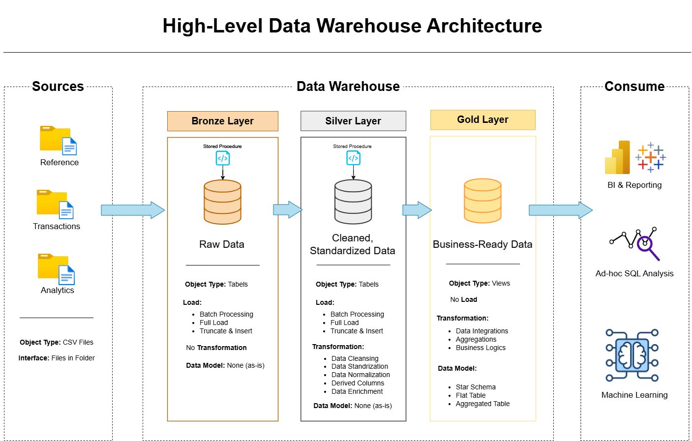

# Logistics Data Warehouse

A modern, end-to-end **Data Warehouse** project built on a realistic logistics operations dataset. This project demonstrates a complete ETL pipeline using the **Medallion Architecture** (Bronze → Silver → Gold), implemented in **Microsoft SQL Server**.

---

## Project Overview

This project simulates the data engineering workflow of a real logistics company. Raw operational data from a Class 8 trucking company (2022–2024) is ingested, cleansed, and transformed into a business-ready analytical layer.

The pipeline is built with production-grade practices: idempotent scripts, stored procedures with error handling, millisecond-level load timing, and a single orchestrator entry point.

---

## Architecture

```
Source CSVs (14 tables)
        │
        ▼
┌───────────────────┐
│   BRONZE LAYER    │  Raw data — loaded as-is from source CSVs
│   (Staging)       │  No transformations, all columns NULLable
└───────┬───────────┘
        │
        ▼
┌───────────────────┐
│   SILVER LAYER    │  Cleansed & standardized data
│  (Transformation) │  Data type casting, NULL handling, deduplication
└───────┬───────────┘
        │
        ▼
┌───────────────────┐
│    GOLD LAYER     │  Business-ready Star Schema
│   (Analytics)     │  Fact & Dimension tables, KPIs
└───────────────────┘
```



---

## Tech Stack

| Tool | Role |
|---|---|
| Microsoft SQL Server | Data Warehouse engine |
| T-SQL | ETL scripting & transformations |
| BULK INSERT | CSV ingestion into Bronze layer |
| Stored Procedures | Modular, reusable pipeline components |

---

## Dataset

| Attribute | Detail |
|---|---|
| Source | [Kaggle — Logistics Operations Database (2022–2024)](https://www.kaggle.com/) |
| Author | Yogape Rodriguez |
| License | MIT |
| Time Period | 2022 – 2024 |
| Total Tables | 14 |
| Total Records | ~361,000 |
| Industry | Logistics & Transportation (USA) |

The dataset simulates the daily operations of a Class 8 trucking company, covering drivers, trucks, trailers, customers, routes, shipments, trips, fuel, maintenance, and safety incidents.

→ See [`docs/DATASET_OVERVIEW.md`](docs/DATASET_OVERVIEW.md) for full details.

---

## Project Structure

```
logistics-data-warehouse/
│
├── datasets/                        # Source CSV files (not tracked in Git)
│   ├── reference/                   # Dimension data (drivers, trucks, customers...)
│   ├── transactions/                # Operational data (trips, loads, fuel...)
│   └── analytics/                   # Pre-aggregated KPIs (monthly metrics)
│
├── docs/                            # Project documentation
│   ├── DATASET_OVERVIEW.md          # Dataset source, structure, and use cases
│   ├── DATABASE_SCHEMA.txt          # Table schemas and key relationships
│   └── data_architecture.png        # Architecture diagram
│
├── scripts/                         # All SQL pipeline scripts
│   ├── init_database.sql            # One-time setup: database + schemas
│   └── bronze/                      # Bronze layer scripts
│       ├── 01_create_reference.sql       # DDL: reference/dimension tables
│       ├── 02_create_transactions.sql    # DDL: transaction tables
│       ├── 03_create_analytics.sql       # DDL: analytics tables
│       ├── 04_load_reference.sql         # Stored procedure: load reference data
│       ├── 05_load_transactions.sql      # Stored procedure: load transaction data
│       ├── 06_load_analytics.sql         # Stored procedure: load analytics data
│       └── 07_load_bronze_layer.sql      # Master orchestrator (single entry point)
│
└── tests/                           # Data quality & validation queries
```

---

## How to Run

### Prerequisites
- Microsoft SQL Server (2019 or later)
- SQL Server Management Studio (SSMS) or Azure Data Studio
- Dataset CSV files placed in the correct `datasets/` subfolders

### Step 1 — Initialize the Database

> ⚠️ **Warning:** This script drops and recreates the `logistics_dwh` database.

```sql
-- Run once
scripts/init_database.sql
```

### Step 2 — Create Bronze Tables

Run in order:

```sql
scripts/bronze/01_create_reference.sql
scripts/bronze/02_create_transactions.sql
scripts/bronze/03_create_analytics.sql
```

### Step 3 — Register Load Procedures

Run in order:

```sql
scripts/bronze/04_load_reference.sql
scripts/bronze/05_load_transactions.sql
scripts/bronze/06_load_analytics.sql
scripts/bronze/07_load_bronze_layer.sql
```

### Step 4 — Run the Full Bronze Pipeline

```sql
EXEC bronze.load_bronze;
```

This single command loads all 14 tables, with per-table timing and row-count output.

---

## Bronze Layer — Source Tables

### Reference (Dimension) Tables
| Table | Description |
|---|---|
| `bronze.drivers` | Driver demographics, license info, employment |
| `bronze.trucks` | Fleet equipment details, acquisition, status |
| `bronze.trailers` | Trailer inventory, types, dimensions |
| `bronze.customers` | Customer accounts, contract types |
| `bronze.facilities` | Terminal and warehouse locations |
| `bronze.routes` | Origin-destination pairs, rates, distances |

### Transaction Tables
| Table | Description |
|---|---|
| `bronze.loads` | Shipment bookings, revenue, booking type |
| `bronze.trips` | Trip execution, fuel, distance, duration |
| `bronze.fuel_purchases` | Fuel transactions, prices, locations |
| `bronze.maintenance_records` | Service history, costs, downtime |
| `bronze.delivery_events` | Pickup/delivery timestamps, on-time status |
| `bronze.safety_incidents` | Accidents, violations, damage costs |

### Analytics Tables (Pre-Aggregated)
| Table | Description |
|---|---|
| `bronze.driver_monthly_metrics` | Monthly driver KPI snapshots |
| `bronze.truck_utilization_metrics` | Monthly truck utilization summaries |

---

## Business Questions This Project Answers

- Which drivers have the best on-time delivery rates?
- Which routes are the most profitable?
- How does truck age affect maintenance costs?
- What is the average fuel cost per trip by route?
- Which customers generate the highest revenue?
- How do seasonal patterns affect load volumes and rates?
- What is the fleet utilization rate per truck per month?
- Which safety incidents were preventable?

---

## License

This project is licensed under the [MIT License](LICENSE).
