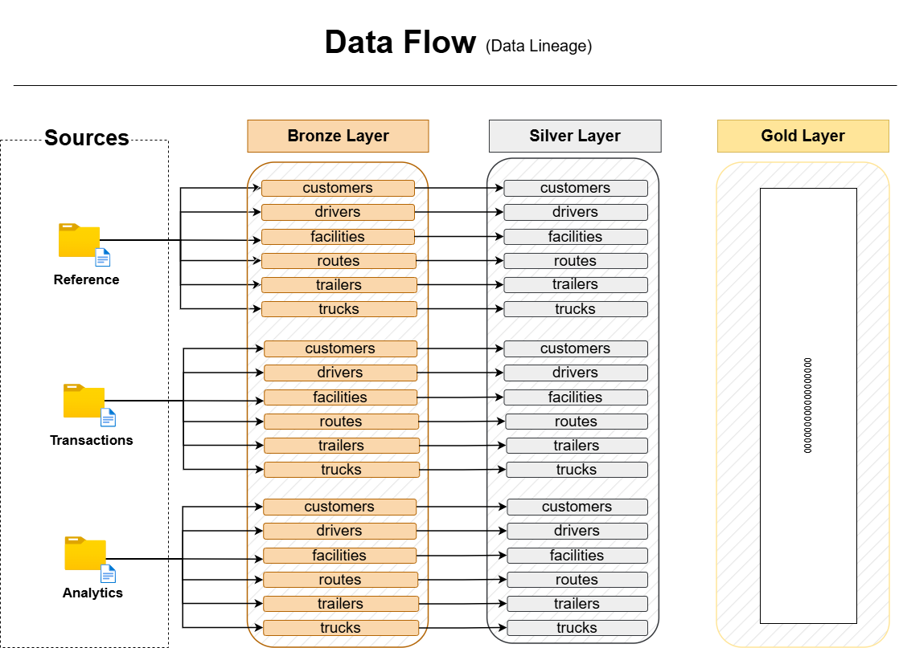

<div align="center">

# 🚛 Logistics Data Warehouse

### *Transforming Raw Fleet & Shipping Operations Into a Unified Analytics Platform*

**An end-to-end enterprise-grade data warehouse built on a realistic Class 8 trucking dataset — engineered with Medallion Architecture, modular stored procedures, and a Star Schema analytics layer.**

[](https://www.microsoft.com/en-us/sql-server)
[]()
[]()
[]()
[](LICENSE)

</div>

---

## 📋 Table of Contents

- [Business Context](#-business-context)
- [Solution Architecture](#-solution-architecture)
- [Data Flow](#-data-flow)
- [Data Sources](#-data-sources)
- [Project Structure](#-project-structure)
- [Pipeline Execution](#-pipeline-execution)
- [Testing & Data Quality](#-testing--data-quality)
- [Business Questions](#-business-questions-this-project-answers)
- [Engineering Decisions](#-engineering-decisions)
- [License](#-license)

---

## 💼 Business Context

In logistics and transportation, operational data is spread across multiple systems — fleet management, dispatch, fuel tracking, maintenance logs, and customer contracts. When these are siloed, operations managers cannot answer basic questions like *"Which driver has the highest on-time rate?"* or *"Which route is the most profitable?"*

**This project solves that problem.**

The **Logistics Data Warehouse** consolidates 14 operational tables from a Class 8 trucking company (2022–2024) into a single analytics-ready platform:

| Business Problem | Engineering Solution |
|---|---|
| Data scattered across fleet, dispatch & finance systems | Unified ingestion pipeline via the Bronze layer |
| Inconsistent formats, NULLs, and bad data types | Standardisation & cleansing in the Silver layer |
| No analytics-ready model | Star Schema dimensional model in the Gold layer |
| No audit trail for data loads | Per-table timing & row-count output on every run |
| No systematic data quality checks | Dedicated `tests/` directory per layer |

---

## 🏛️ Solution Architecture

The warehouse follows the **Medallion Architecture** (Bronze → Silver → Gold) — a modern layered pattern ensuring data lineage, traceability, and progressive refinement.


### Layer Responsibilities

```
┌──────────────────────────────────────────────────────────────────────┐
│                         DATA SOURCES                                  │
│   14 CSV files — reference, transaction & pre-aggregated metrics      │
│   (~361,000 records | 2022–2024 | USA trucking operations)            │
└──────────────────────────────┬───────────────────────────────────────┘
                               ▼
┌──────────────────────────────────────────────────────────────────────┐
│  🥉 BRONZE  — Raw Ingestion (Schema: bronze)                         │
│  BULK INSERT from CSV  │  No transformations  │  All columns NULLable │
└──────────────────────────────┬───────────────────────────────────────┘
                               ▼
┌──────────────────────────────────────────────────────────────────────┐
│  🥈 SILVER  — Cleansed & Standardised (Schema: silver)              │
│  Type casting  │  Deduplication  │  NULL handling  │  Audit column   │
└──────────────────────────────┬───────────────────────────────────────┘
                               ▼
┌──────────────────────────────────────────────────────────────────────┐
│  🥇 GOLD  — Business-Ready Star Schema (Schema: gold)               │
│  Dimension tables  │  Fact tables  │  KPIs & analytical views        │
└──────────────────────────────────────────────────────────────────────┘
```

---

## 🌊 Data Flow



```
[Source CSVs — 14 tables]
       │
       ▼  BULK INSERT (stored proc: bronze.load_bronze)
[Bronze Tables] ── Raw, untransformed, exact replica of source
       │
       ▼  ETL stored procedures per table
[Silver Tables] ── Cleansed, typed, deduplicated + audit timestamp
       │
       ▼  Business logic JOINs + surrogate key generation
[Gold Layer]    ── Star Schema: dimensions + fact tables
```

---

## 📦 Data Sources

> Source: [Kaggle — Logistics Operations Database (2022–2024)](https://www.kaggle.com/) by Yogape Rodriguez (MIT License)
> → Full details in [`docs/DATASET_OVERVIEW.md`](docs/DATASET_OVERVIEW.md)

### Reference (Dimension) Tables

| Table | Description | Key Columns |
|---|---|---|
| `drivers` | Driver demographics, license, employment | `driver_id`, `cdl_class`, `employment_status`, `years_experience` |
| `trucks` | Fleet equipment, acquisition, status | `truck_id`, `make`, `model`, `year`, `status` |
| `trailers` | Trailer inventory, types, dimensions | `trailer_id`, `trailer_type`, `capacity` |
| `customers` | Customer accounts, contract types | `customer_id`, `contract_type`, `credit_limit` |
| `facilities` | Terminal & warehouse locations | `facility_id`, `facility_type`, `state` |
| `routes` | Origin-destination pairs, rates, distances | `route_id`, `origin`, `destination`, `distance_miles` |

### Transaction Tables

| Table | Description | Key Columns |
|---|---|---|
| `loads` | Shipment bookings & revenue | `load_id`, `customer_id`, `route_id`, `revenue` |
| `trips` | Trip execution, fuel, distance | `trip_id`, `load_id`, `driver_id`, `truck_id`, `actual_miles` |
| `fuel_purchases` | Fuel transactions & prices | `purchase_id`, `truck_id`, `gallons`, `price_per_gallon` |
| `maintenance_records` | Service history & costs | `record_id`, `truck_id`, `maintenance_type`, `total_cost` |
| `delivery_events` | Pickup/delivery timestamps, on-time status | `event_id`, `load_id`, `on_time_flag` |
| `safety_incidents` | Accidents, violations, damage costs | `incident_id`, `driver_id`, `incident_type`, `damage_cost` |

### Pre-Aggregated Analytics Tables

| Table | Description |
|---|---|
| `driver_monthly_metrics` | Monthly driver KPI snapshots |
| `truck_utilization_metrics` | Monthly truck utilisation summaries |

---

## 📁 Project Structure

```
logistics-data-warehouse/
│
├── 📂 datasets/                         # Source CSV files (not tracked in Git)
│   ├── reference/                       # Dimension data (drivers, trucks, customers…)
│   ├── transactions/                    # Operational data (trips, loads, fuel…)
│   └── analytics/                      # Pre-aggregated monthly KPIs
│
├── 📂 docs/                             # Technical documentation & diagrams
│   ├── data_architecture.png            # Medallion architecture overview
│   ├── data_flow.png                    # End-to-end pipeline data flow
│   ├── entity_relationships.png         # Entity-relationship diagram
│   ├── DATASET_OVERVIEW.md              # Dataset source, structure & use cases
│   └── DATABASE_SCHEMA.txt             # Table schemas & key relationships
│
├── 📂 scripts/                          # All SQL pipeline scripts
│   ├── init_database.sql               # Database & schema bootstrap (run once)
│   │
│   ├── bronze/                          # 🥉 Bronze layer — raw ingestion
│   │   ├── 01_create_reference.sql     # DDL — reference/dimension tables
│   │   ├── 02_create_transactions.sql  # DDL — transaction tables
│   │   ├── 03_create_analytics.sql     # DDL — analytics tables
│   │   ├── 04_load_reference.sql       # Stored proc — load reference data
│   │   ├── 05_load_transactions.sql    # Stored proc — load transaction data
│   │   ├── 06_load_analytics.sql       # Stored proc — load analytics data
│   │   └── 07_load_bronze_layer.sql    # Master orchestrator (single entry point)
│   │
│   └── silver/                          # 🥈 Silver layer — cleanse & standardise
│       ├── 01_create_reference.sql     # DDL — silver reference tables
│       ├── 02_create_transactions.sql  # DDL — silver transaction tables
│       ├── 03_create_analytics.sql     # DDL — silver analytics tables
│       └── 04_load_drivers.sql         # Stored proc — load & cleanse drivers
│
├── 📂 tests/                            # Data quality & validation scripts
│   ├── silver/                          # Silver layer quality checks
│   │   ├── 01_exploration.sql          # Bronze layer profiling & discovery
│   │   └── 02_quality_checks_drivers.sql  # Drivers table quality checks
│   └── gold/                            # Gold layer validation scripts
│
└── README.md                            # This file
```

---

## ⚙️ Pipeline Execution

Execute the pipeline **sequentially** — each layer depends on the previous.

### Step 1 — Database Initialisation

> ⚠️ **Warning:** This script drops and recreates the `logistics_dwh` database.

```sql
:r scripts/init_database.sql
```

---

### Step 2 — 🥉 Bronze Layer (Raw Ingestion)

```sql
-- Create bronze table schemas (reference, transactions, analytics)
:r scripts/bronze/01_create_reference.sql
:r scripts/bronze/02_create_transactions.sql
:r scripts/bronze/03_create_analytics.sql

-- Register load stored procedures
:r scripts/bronze/04_load_reference.sql
:r scripts/bronze/05_load_transactions.sql
:r scripts/bronze/06_load_analytics.sql
:r scripts/bronze/07_load_bronze_layer.sql
```

Then execute the full pipeline with a single command:

```sql
EXEC bronze.load_bronze;
```

**What happens:** All 14 tables are bulk-loaded from CSV with zero transformation. Per-table timing and row counts are printed on every run. Any re-run will truncate and reload (idempotent).

---

### Step 3 — 🥈 Silver Layer (Cleanse & Standardise)

```sql
-- Create silver table schemas
:r scripts/silver/01_create_reference.sql
:r scripts/silver/02_create_transactions.sql
:r scripts/silver/03_create_analytics.sql

-- Run individual table load procedures
:r scripts/silver/04_load_drivers.sql
```

**What happens:** Source data is cleansed, type-cast, deduplicated, and enriched with a `dwh_create_date` audit timestamp.

> 🚧 **Silver layer is actively in development** — additional table load procedures are being added incrementally.

---

### Step 4 — 🥇 Gold Layer (Star Schema)

> 🔜 Coming soon — dimensional model and fact tables built on top of the Silver layer.

---

## 🧪 Testing & Data Quality

Data quality is a **first-class engineering concern** in this project. Every source table has a corresponding validation script before it is promoted to Silver.

### Quality Check Dimensions

| Dimension | Checks Performed |
|---|---|
| **Completeness** | NULL checks on mandatory fields (IDs, dates, names) |
| **Uniqueness** | Duplicate detection on primary keys |
| **Validity** | Date logic checks, negative value detection, format validation |
| **Consistency** | Trimming, standardisation of categorical values |
| **Range** | Min/max sanity checks on numeric and date columns |

### Current Test Coverage

| Script | Table Covered |
|---|---|
| `tests/silver/01_exploration.sql` | Bronze layer — overall profiling |
| `tests/silver/02_quality_checks_drivers.sql` | `bronze.drivers` |

---

## ❓ Business Questions This Project Answers

- Which drivers have the best on-time delivery rates?
- Which routes are the most profitable?
- How does truck age affect maintenance costs?
- What is the average fuel cost per trip by route?
- Which customers generate the highest revenue?
- How do seasonal patterns affect load volumes and rates?
- What is the fleet utilisation rate per truck per month?
- Which safety incidents were most costly?

---

## 🧠 Engineering Decisions

### Why Stored Procedures for ETL?
Stored procedures encapsulate transformation logic close to the data, enabling atomic transactions, built-in error handling (`TRY/CATCH`), execution timing, and row-count logging — all version-controlled like application code.

### Why Truncate-and-Load (Not Incremental)?
For a dataset of this scale (~361K rows), a full truncate-and-reload on each run guarantees idempotency without the complexity of change-data-capture (CDC) or watermark management. The right tradeoff at this scale.

### Why Separate DDL from Load Scripts?
Separating schema creation (`01_create_*.sql`) from data loading (`04_load_*.sql`) means schema changes can be reviewed and deployed independently — load jobs never break because of a DDL modification.

### Why a Tests Directory?
Separating validation logic from production ETL is a senior engineering discipline. The `tests/` directory provides a reusable audit trail of every data quality decision — invaluable for onboarding new engineers and diagnosing future data issues.

---

## 📄 License

This project is open-source and available under the [MIT License](LICENSE).

---

<div align="center">

**Built with engineering rigor. Designed for logistics intelligence.**

*If you found this project valuable, please consider giving it a ⭐*

[](https://github.com/adhameltantawi)

</div>
