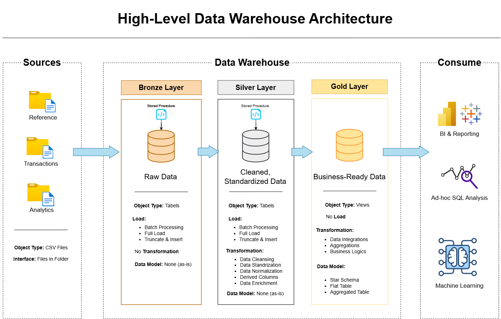
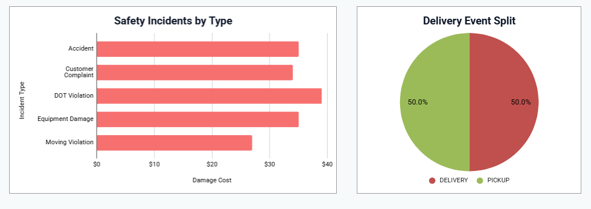
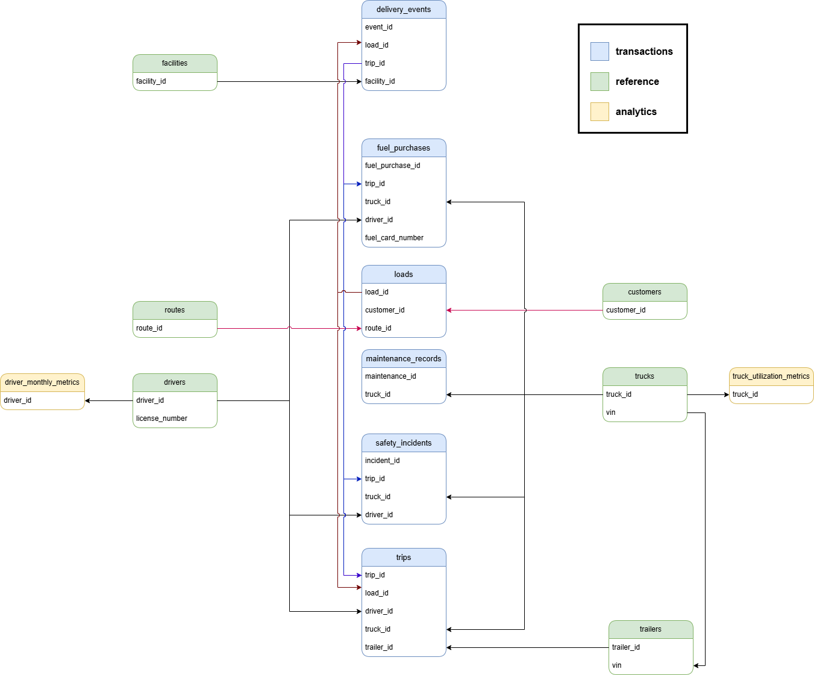
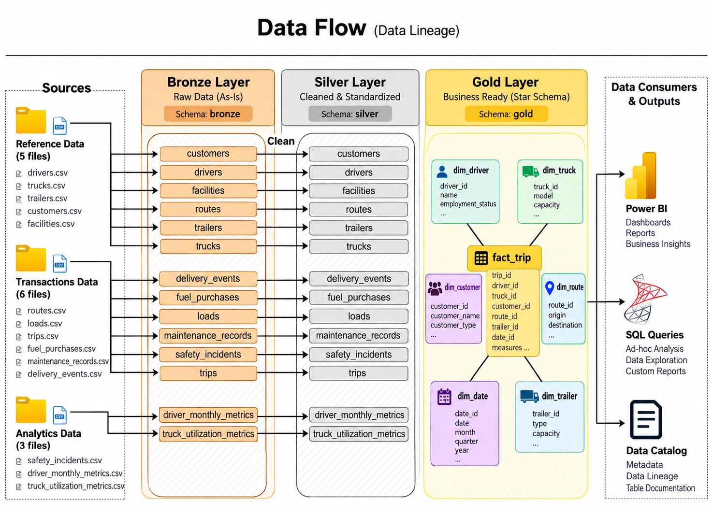

<div align="center">

# Logistics Data Warehouse

### *Transforming Raw Fleet & Shipping Operations Into a Unified Analytics Platform*

**An end-to-end enterprise-grade data warehouse built on a realistic Class 8 trucking dataset - engineered with Medallion Architecture, modular stored procedures, and a Star Schema analytics layer.**

[](https://www.microsoft.com/en-us/sql-server)
[]()
[]()
[]()
[](LICENSE)

</div>

---

## Table of Contents

- [Business Context](#business-context)
- [Solution Architecture](#solution-architecture)
- [Entity Relationships](#entity-relationships)
- [Data Flow](#data-flow)
- [Star Schema](#star-schema)
- [Data Sources](#data-sources)
- [Data Catalog](#-data-catalog)
- [Project Structure](#project-structure)
- [Quick Setup](#-quick-setup)
- [Pipeline Execution](#pipeline-execution)
- [Testing & Data Quality](#testing--data-quality)
- [Business Questions](#business-questions-this-project-answers)
- [Engineering Decisions](#engineering-decisions)
- [License](#license)

---

## Business Context

In logistics and transportation, operational data is spread across multiple systems - fleet management, dispatch, fuel tracking, maintenance logs, and customer contracts. When these are siloed, operations managers cannot answer basic questions like *"Which driver has the highest on-time rate?"* or *"Which route is the most profitable?"*

**This project solves that problem.**

The **Logistics Data Warehouse** consolidates 14 operational tables from a Class 8 trucking company (2022-2024) into a single analytics-ready platform:

| Business Problem | Engineering Solution |
|---|---|
| Data scattered across fleet, dispatch & finance systems | Unified ingestion pipeline via the Bronze layer |
| Inconsistent formats, NULLs, and bad data types | Standardisation & cleansing in the Silver layer |
| No analytics-ready model | Star Schema dimensional model in the Gold layer |
| No audit trail for data loads | Per-table timing & row-count output on every run |
| No systematic data quality checks | Dedicated `tests/` directory per layer |

---

## Solution Architecture

The warehouse follows the **Medallion Architecture** (Bronze -> Silver -> Gold) - a modern layered pattern ensuring data lineage, traceability, and progressive refinement.



### Layer Responsibilities

```
+----------------------------------------------------------------------+
|                         DATA SOURCES                                 |
|   14 CSV files - reference, transaction & pre-aggregated metrics     |
|   (~361,000 records | 2022-2024 | USA trucking operations)           |
+------------------------------+---------------------------------------+
                               |
                               v
+----------------------------------------------------------------------+
|  BRONZE  - Raw Ingestion (Schema: bronze)                            |
|  BULK INSERT from CSV  |  No transformations  |  All columns NULLable|
+------------------------------+---------------------------------------+
                               |
                               v
+----------------------------------------------------------------------+
|  SILVER  - Cleansed & Standardised (Schema: silver)                  |
|  Type casting  |  Deduplication  |  NULL handling  |  Audit column   |
+------------------------------+---------------------------------------+
                               |
                               v
+----------------------------------------------------------------------+
|  GOLD  - Business-Ready Star Schema (Schema: gold)                   |
|  Dimension tables  |  Fact tables  |  Surrogate keys  |  KPIs        |
+----------------------------------------------------------------------+
```

---

## Dashboard & Analytics

The culmination of the data warehouse is a comprehensive **Executive Dashboard** that provides real-time insights into fleet operations, financial performance, and customer metrics. 

### Google Sheets Dashboard
The interactive dashboard has been fully built in Google Sheets using the Gold Layer data.
- **[View Live Google Sheets Dashboard](https://docs.google.com/spreadsheets/d/1KwzlXp6mJhAZQ7D-3wx9NzWysxX2GLc3MCvLxTdEde0/edit?usp=sharing)**




### Power BI Integration
This repository contains a full Power BI project (`.pbip` format). The semantic model connects directly to the Gold Layer star schema.
- `dashboard.Report/`: Contains the visual layout and design configurations.
- `dashboard.SemanticModel/`: Contains the analytical data model and DAX measures.

### Interactive Views
- **Executive Dashboard Preview:** An HTML mock-up of the dashboard is available in `logistics_dashboard.html` showing KPIs (Revenue, Margins, On-time delivery) and visualizations.
- **Detailed Presentation:** For a full breakdown of the insights, KPIs, and business recommendations derived from this dashboard, refer to `docs/DASHBOARD_PRESENTATION.md`.

---

## Entity Relationships

The diagram below maps the foreign-key relationships across the 14 source tables - showing how drivers, trucks, loads, trips, and customers interconnect.



*Note: For an interactive view of the final Star Schema, open `schema_documentation.html`.*

---

## Data Flow



```
[Source CSVs - 14 tables]
       |
       v  BULK INSERT (stored proc: bronze.load_bronze)
[Bronze Tables] -- Raw, untransformed, exact replica of source
       |
       v  ETL stored procedures per table (stored proc: silver.load_silver)
[Silver Tables] -- Cleansed, typed, deduplicated + audit timestamp
       |
       v  Business logic JOINs + surrogate key generation (stored proc: gold.load_gold)
[Gold Layer]    -- Star Schema: 7 dimensions + 5 fact tables
```

---

## Star Schema

The Gold layer implements a **Star Schema** dimensional model optimised for analytical queries. All dimension tables use **surrogate keys** (INT IDENTITY) for fast joins, while retaining natural keys for traceability.

### Dimension Tables

| Table | Source | Key Columns | Enrichments |
|---|---|---|---|
| `gold.dim_driver` | `silver.drivers` | `driver_key` (surrogate), `driver_id` (natural) | `full_name` = first + last |
| `gold.dim_truck` | `silver.trucks` | `truck_key`, `truck_id` | `truck_age_years` = current year - model year |
| `gold.dim_trailer` | `silver.trailers` | `trailer_key`, `trailer_id` | - |
| `gold.dim_customer` | `silver.customers` | `customer_key`, `customer_id` | - |
| `gold.dim_facility` | `silver.facilities` | `facility_key`, `facility_id` | - |
| `gold.dim_route` | `silver.routes` | `route_key`, `route_id` | `lane_description` = origin -> destination |
| `gold.dim_date` | Generated (2020-2030) | `date_key` (YYYYMMDD) | year, quarter, month, week, day, is_weekend |

### Fact Tables

| Table | Grain | Dimension Keys | Key Measures |
|---|---|---|---|
| `gold.fact_trip` | One trip | driver, truck, trailer, customer, route, date | revenue, total_revenue, distance, duration, fuel, MPG |
| `gold.fact_fuel_purchase` | One fuel transaction | driver, truck, date | gallons, price_per_gallon, total_cost |
| `gold.fact_maintenance` | One service record | truck, date | labor_cost, parts_cost, total_cost, downtime_hours |
| `gold.fact_safety` | One incident | driver, truck, date | vehicle_damage_cost, cargo_damage_cost, total_damage_cost, claim_amount |
| `gold.fact_delivery` | One pickup/delivery | facility | detention_minutes, on_time_flag |

---

## Data Sources

> Source: [Kaggle - Logistics Operations Database (2022-2024)](https://www.kaggle.com/) by Yogape Rodriguez (MIT License)
> -> Full details in [`docs/DATASET_OVERVIEW.md`](docs/DATASET_OVERVIEW.md)

### Reference (Dimension) Tables

| Table | Description | Key Columns |
|---|---|---|
| `drivers` | Driver demographics, license, employment | `driver_id`, `cdl_class`, `employment_status`, `years_experience` |
| `trucks` | Fleet equipment, acquisition, status | `truck_id`, `make`, `model`, `year`, `status` |
| `trailers` | Trailer inventory, types, dimensions | `trailer_id`, `trailer_type`, `capacity` |
| `customers` | Customer accounts, contract types | `customer_id`, `contract_type`, `credit_limit` |
| `facilities` | Terminal & warehouse locations | `facility_id`, `facility_type`, `state` |
| `routes` | Origin-destination pairs, rates, distances | `route_id`, `origin`, `destination`, `distance_miles` |

### Transaction Tables

| Table | Description | Key Columns |
|---|---|---|
| `loads` | Shipment bookings & revenue | `load_id`, `customer_id`, `route_id`, `revenue` |
| `trips` | Trip execution, fuel, distance | `trip_id`, `load_id`, `driver_id`, `truck_id`, `actual_miles` |
| `fuel_purchases` | Fuel transactions & prices | `purchase_id`, `truck_id`, `gallons`, `price_per_gallon` |
| `maintenance_records` | Service history & costs | `record_id`, `truck_id`, `maintenance_type`, `total_cost` |
| `delivery_events` | Pickup/delivery timestamps, on-time status | `event_id`, `load_id`, `on_time_flag` |
| `safety_incidents` | Accidents, violations, damage costs | `incident_id`, `driver_id`, `incident_type`, `damage_cost` |

### Pre-Aggregated Analytics Tables

| Table | Description |
|---|---|
| `driver_monthly_metrics` | Monthly driver KPI snapshots |
| `truck_utilization_metrics` | Monthly truck utilisation summaries |

---

## 📖 Data Catalog

The **Gold layer** is the authoritative analytics-ready data — fully documented for data analysts, BI developers, and report builders.

📄 **[Full Data Catalog → docs/DATA_CATALOG.md](docs/DATA_CATALOG.md)**

### What's in the catalog

| Object | Type | Grain / Purpose |
|---|---|---|
| `gold.dim_driver` | Dimension | One row per driver version (SCD2) |
| `gold.dim_truck` | Dimension | One row per fleet truck |
| `gold.dim_trailer` | Dimension | One row per trailer |
| `gold.dim_customer` | Dimension | One row per customer account |
| `gold.dim_facility` | Dimension | One row per terminal / warehouse |
| `gold.dim_route` | Dimension | One row per origin-destination lane |
| `gold.dim_date` | Dimension | One row per calendar day (2020–2030), with `is_holiday` + `holiday_name` |
| `gold.fact_trip` | Fact | One row per completed trip — revenue, miles, fuel, duration |
| `gold.fact_fuel_purchase` | Fact | One row per fuel stop — gallons, cost, location |
| `gold.fact_maintenance` | Fact | One row per service event — labor, parts, downtime |
| `gold.fact_safety` | Fact | One row per incident — damage costs, at-fault, preventable flags |
| `gold.fact_delivery` | Fact | One row per pickup/delivery event — detention, on-time flag |
| `gold.vw_driver_performance` | KPI View | Driver trips, miles, revenue, safety incidents, on-time % |
| `gold.vw_route_profitability` | KPI View | Lane revenue, revenue/mile, trip count |
| `gold.vw_fleet_utilization` | KPI View | Truck trips, miles, revenue, maintenance — monthly grain |
| `gold.vw_fuel_efficiency` | KPI View | Actual vs expected MPG by driver and truck |

---

## Project Structure

```text
logistics-data-warehouse/
│
├── datasets/                            # Source CSV files (not tracked in Git — see .gitignore)
│   ├── reference/                       # Dimension data (drivers, trucks, customers…)
│   ├── transactions/                    # Operational data (trips, loads, fuel…)
│   └── analytics/                       # Pre-aggregated monthly KPIs
│
├── docs/                                # Technical documentation & diagrams
│   ├── data_architecture.png            # Medallion architecture overview
│   ├── data_flow.png                    # End-to-end pipeline data flow
│   ├── entity_relationships.png         # Entity-relationship diagram
│   ├── DATASET_OVERVIEW.md              # Dataset source, structure & use cases
│   ├── DATABASE_SCHEMA.txt              # Table schemas & key relationships
│   ├── DATA_CATALOG.md                  # 📖 Gold layer data catalog (for analysts)
│   └── POWER_BI_GUIDE.md               # Power BI connection & dashboard setup guide
│
├── scripts/                             # All SQL pipeline scripts
│   ├── init_database.sql                # Database & schema bootstrap (run once)
│   │
│   ├── bronze/                          # 🥉 Bronze layer — raw ingestion
│   │   ├── 01_create_reference.sql      # DDL — reference/dimension tables
│   │   ├── 02_create_transactions.sql   # DDL — transaction tables
│   │   ├── 03_create_analytics.sql      # DDL — analytics tables
│   │   ├── 04_load_reference.sql        # Stored proc — load reference data
│   │   ├── 05_load_transactions.sql     # Stored proc — load transaction data
│   │   ├── 06_load_analytics.sql        # Stored proc — load analytics data
│   │   ├── 07_load_bronze_layer.sql     # Master orchestrator (single entry point)
│   │   └── 08_create_pipeline_log.sql   # Pipeline audit log table + helper proc
│   │
│   ├── silver/                          # 🥈 Silver layer — cleanse & standardise
│   │   ├── 01_create_reference.sql      # DDL — silver reference tables + audit col
│   │   ├── 02_create_transactions.sql   # DDL — silver transaction tables + audit col
│   │   ├── 03_create_analytics.sql      # DDL — silver analytics tables + audit col
│   │   ├── 04_load_drivers.sql          # Stored proc — cleanse & load drivers
│   │   ├── 05_load_customers.sql        # …customers
│   │   ├── 06_load_facilities.sql       # …facilities
│   │   ├── 07_load_routes.sql           # …routes
│   │   ├── 08_load_trailers.sql         # …trailers
│   │   ├── 09_load_trucks.sql           # …trucks
│   │   ├── 10_load_delivery_events.sql  # …delivery events
│   │   ├── 11_load_fuel_purchases.sql   # …fuel purchases
│   │   ├── 12_load_loads.sql            # …loads
│   │   ├── 13_load_maintenance_records.sql  # …maintenance records
│   │   ├── 14_load_safety_incidents.sql     # …safety incidents
│   │   ├── 15_load_trips.sql            # …trips
│   │   ├── 16_load_driver_monthly_metrics.sql   # …driver metrics
│   │   ├── 17_load_truck_utilization_metrics.sql # …truck metrics
│   │   ├── 18_load_silver_layer.sql     # Master orchestrator (single entry point)
│   │   └── 19_load_single_table.sql     # Parameterized single-table re-run wrapper
│   │
│   ├── gold/                            # 🥇 Gold layer — Star Schema
│   │   ├── 01_create_dimensions.sql     # DDL — 7 dimension tables (surrogate keys)
│   │   ├── 02_create_facts.sql          # DDL — 5 fact tables
│   │   ├── 03_load_dimensions.sql       # Stored proc — load all dimensions + date dim
│   │   ├── 04_load_facts.sql            # Stored proc — load all facts
│   │   ├── 05_load_gold_layer.sql       # Master orchestrator (single entry point)
│   │   ├── 06_create_indexes.sql        # Non-clustered indexes on FK columns
│   │   ├── 07_create_fk_constraints.sql # Foreign key constraints (fact → dimension)
│   │   ├── 08_scd2_dim_driver.sql       # SCD Type 2 MERGE procedure for dim_driver
│   │   └── 09_extended_properties.sql   # Column-level MS_Description documentation
│   │
│   └── analytics/                       # 📊 Analytics layer — business intelligence
│       ├── 01_business_questions.sql    # 8 business question queries
│       └── 02_create_kpi_views.sql      # KPI views: driver, route, fleet, fuel
│
├── tests/                               # Data quality & validation scripts
│   ├── silver/                          # 🥈 Silver layer quality checks (16 scripts)
│   └── gold/                            # 🥇 Gold layer validation scripts (2 scripts)
│
├── .github/
│   └── workflows/
│       └── sql-lint.yml                 # GitHub Actions CI — sqlfluff SQL linting
│
├── run_pipeline.ps1                     # PowerShell end-to-end pipeline runner
├── .gitignore                           # Excludes datasets/, OS files, SQL Server artefacts
└── README.md                            # This file
```


---

## Pipeline Execution

Execute the pipeline **sequentially** - each layer depends on the previous.

### Step 1 - Database Initialisation

> **Warning:** This script drops and recreates the `logistics_dwh` database.

```sql
:r scripts/init_database.sql
```

### Step 2 - Bronze Layer (Raw Ingestion)

```sql
-- Create bronze table schemas (reference, transactions, analytics)
:r scripts/bronze/01_create_reference.sql
:r scripts/bronze/02_create_transactions.sql
:r scripts/bronze/03_create_analytics.sql

-- Register load stored procedures
:r scripts/bronze/04_load_reference.sql
:r scripts/bronze/05_load_transactions.sql
:r scripts/bronze/06_load_analytics.sql
:r scripts/bronze/07_load_bronze_layer.sql
```

Then execute the full pipeline with a single command:

```sql
EXEC bronze.load_bronze;
```

**What happens:** All 14 tables are bulk-loaded from CSV with zero transformation. Per-table timing and row counts are printed on every run. Any re-run will truncate and reload (idempotent).

### Step 3 - Silver Layer (Cleanse & Standardise)

```sql
-- Create silver table schemas (reference, transactions, analytics)
:r scripts/silver/01_create_reference.sql
:r scripts/silver/02_create_transactions.sql
:r scripts/silver/03_create_analytics.sql

-- Register all 14 table load stored procedures
:r scripts/silver/04_load_drivers.sql
:r scripts/silver/05_load_customers.sql
:r scripts/silver/06_load_facilities.sql
:r scripts/silver/07_load_routes.sql
:r scripts/silver/08_load_trailers.sql
:r scripts/silver/09_load_trucks.sql
:r scripts/silver/10_load_delivery_events.sql
:r scripts/silver/11_load_fuel_purchases.sql
:r scripts/silver/12_load_loads.sql
:r scripts/silver/13_load_maintenance_records.sql
:r scripts/silver/14_load_safety_incidents.sql
:r scripts/silver/15_load_trips.sql
:r scripts/silver/16_load_driver_monthly_metrics.sql
:r scripts/silver/17_load_truck_utilization_metrics.sql
:r scripts/silver/18_load_silver_layer.sql
```

Then execute the full pipeline with a single command:

```sql
EXEC silver.load_silver;
```

**What happens:** Each of the 14 Bronze tables is cleansed and loaded into Silver with:
- **TRIM** on all string columns
- **UPPER** standardisation on state codes, VINs, and flags
- **Deduplication** via `ROW_NUMBER()` on primary keys
- **Range validation** on numeric fields (negative values -> NULL)
- **`dwh_create_date`** audit timestamp on every record

### Step 4 - Gold Layer (Star Schema)

```sql
-- Create dimension and fact table schemas
:r scripts/gold/01_create_dimensions.sql
:r scripts/gold/02_create_facts.sql

-- Register load stored procedures
:r scripts/gold/03_load_dimensions.sql
:r scripts/gold/04_load_facts.sql
:r scripts/gold/05_load_gold_layer.sql
```

Then execute the full pipeline with a single command:

```sql
EXEC gold.load_gold;
```

**What happens:** 7 dimension tables are populated from Silver (including a generated date dimension spanning 2020-2030), then 5 fact tables are loaded by JOINing Silver transactional data with dimension surrogate keys. Derived measures like `total_revenue` and `total_damage_cost` are calculated during load.

---

## Full Pipeline (End-to-End)

After all scripts have been registered, the entire warehouse can be refreshed with three commands:

```sql
EXEC bronze.load_bronze;
EXEC silver.load_silver;
EXEC gold.load_gold;
```

---

## Testing & Data Quality

Data quality is a **first-class engineering concern** in this project. Every source table has a corresponding validation script before it is promoted to the next layer.

### Quality Check Dimensions

| Dimension | Checks Performed |
|---|---|
| **Completeness** | NULL checks on mandatory fields (IDs, dates, names) |
| **Uniqueness** | Duplicate detection on primary keys (single & composite) |
| **Validity** | Date logic checks, negative value detection, format validation |
| **Consistency** | Trimming, standardisation of categorical values |
| **Range** | Min/max sanity checks on numeric and date columns |
| **Referential Integrity** | Orphaned foreign key detection (Gold layer) |
| **Reconciliation** | Silver-to-Gold row count matching |

### Test Coverage

| Layer | Script | Table Covered |
|---|---|---|
| Silver | `01_exploration.sql` | Bronze layer - overall profiling |
| Silver | `02_quality_checks_drivers.sql` | `bronze.drivers` |
| Silver | `03_quality_checks_customers.sql` | `bronze.customers` |
| Silver | `04_explore_customer_type.sql` | `bronze.customers` - type analysis |
| Silver | `05_quality_checks_facilities.sql` | `bronze.facilities` |
| Silver | `06_quality_checks_routes.sql` | `bronze.routes` |
| Silver | `07_quality_checks_trailers.sql` | `bronze.trailers` |
| Silver | `08_quality_checks_trucks.sql` | `bronze.trucks` |
| Silver | `09_quality_checks_delivery_events.sql` | `bronze.delivery_events` |
| Silver | `10_quality_checks_fuel_purchases.sql` | `bronze.fuel_purchases` |
| Silver | `11_quality_checks_loads.sql` | `bronze.loads` |
| Silver | `12_quality_checks_maintenance_records.sql` | `bronze.maintenance_records` |
| Silver | `13_quality_checks_safety_incidents.sql` | `bronze.safety_incidents` |
| Silver | `14_quality_checks_trips.sql` | `bronze.trips` |
| Silver | `15_quality_checks_driver_monthly_metrics.sql` | `bronze.driver_monthly_metrics` |
| Silver | `16_quality_checks_truck_utilization_metrics.sql` | `bronze.truck_utilization_metrics` |
| Gold | `01_quality_checks_dimensions.sql` | All 7 dimension tables |
| Gold | `02_quality_checks_facts.sql` | All 5 fact tables |

---

## Business Questions This Project Answers

- Which drivers have the best on-time delivery rates?
- Which routes are the most profitable?
- How does truck age affect maintenance costs?
- What is the average fuel cost per trip by route?
- Which customers generate the highest revenue?
- How do seasonal patterns affect load volumes and rates?
- What is the fleet utilisation rate per truck per month?
- Which safety incidents were most costly?

---

## Engineering Decisions

### Why Stored Procedures for ETL?
Stored procedures encapsulate transformation logic close to the data, enabling atomic transactions, built-in error handling (`TRY/CATCH`), execution timing, and row-count logging - all version-controlled like application code.

### Why Truncate-and-Load (Not Incremental)?
For a dataset of this scale (~361K rows), a full truncate-and-reload on each run guarantees idempotency without the complexity of change-data-capture (CDC) or watermark management. The right tradeoff at this scale.

### Why Separate DDL from Load Scripts?
Separating schema creation (`01_create_*.sql`) from data loading (`04_load_*.sql`) means schema changes can be reviewed and deployed independently - load jobs never break because of a DDL modification.

### Why Surrogate Keys in Gold?
Integer surrogate keys (`INT IDENTITY`) are smaller, faster for joins, and independent of source system key changes. Natural keys are retained alongside surrogate keys for traceability and debugging.

### Why a Date Dimension?
A pre-generated calendar table (`gold.dim_date`) enables time-based grouping (year, quarter, month, day, weekend) without runtime date functions - essential for performant analytical queries and BI tool compatibility.

### Why a Tests Directory?
Separating validation logic from production ETL is a senior engineering discipline. The `tests/` directory provides a reusable audit trail of every data quality decision - invaluable for onboarding new engineers and diagnosing future data issues.

---

## License

This project is open-source and available under the [MIT License](LICENSE).

---

<div align="center">

**Built with engineering rigor. Designed for logistics intelligence.**

*If you found this project valuable, please consider giving it a star on GitHub*

[](https://github.com/adhameltantawi)

</div>
